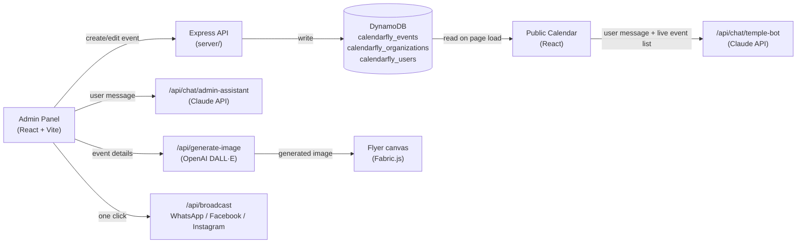

# CalendarFly — Architecture

## System Design

## Tech stack

| Layer | Technology |
|---|---|
| Frontend | React 18, Vite, Fabric.js (flyer canvas) |
| Backend | Node.js, Express |
| Database | AWS DynamoDB (`calendarfly_events`, `calendarfly_organizations`, `calendarfly_users`) |
| Hosting | AWS App Runner (containerized via Docker), images in AWS ECR |
| AI — chat | Anthropic Claude API |
| AI — images | OpenAI DALL·E |
| Messaging | WhatsApp Business API, Meta Graph API (Facebook Page / Instagram) |
| Auth | Session-based (admin panel), env-var credentials — no hardcoded secrets |
| i18n | English, Tamil, Telugu, Hindi, Kannada (Noto Sans font families) |

## Key API routes

| Route | Purpose |
|---|---|
| `GET /api/events`, `/api/events/upcoming`, `/api/events/panchang` | Event + panchang data, read by both admin and public calendar |
| `POST /api/chat/temple-bot` | Public-facing AI chatbot |
| `POST /api/chat/admin-assistant` | In-admin-panel AI assistant (navigates the app, e.g. "open analytics") |
| `POST /api/generate-image` | AI flyer image generation (OpenAI DALL·E) |
| `POST /api/flyer/upload`, `GET /api/flyer/list` | Flyer image library |
| `POST /api/broadcast`, `/api/broadcast/whatsapp-template` | Sends the flyer/message out to WhatsApp / Facebook / Instagram |
| `POST /api/organizations/signup` | Multi-tenant self-serve org creation |

## How It Works — the AI logic

### 1. The chatbot: a lightweight RAG pattern, not a static FAQ

Rather than a vector database, CalendarFly grounds its chatbot in a simpler way that's well-suited to a calendar's scale of data:

1. On page load, the public calendar fetches real events from `GET /api/events` (falling back to `/api/events/upcoming`) and holds them in React state.
2. When a visitor sends a chat message, the frontend filters that already-loaded list down to future, non-panchang events, sorts by date, and takes the next 20 — formatted as plain text (`2026-08-16: Garuda Panchami at 10:00 AM`).
3. That text block is sent to the backend alongside the user's message.
4. The backend (`server/routes/chat.js`) builds a system prompt combining: today's date (so "this week" resolves correctly), fixed organization details (name, address, hours), and the live event list — then calls `anthropic.messages.create()` with Claude.
5. The response is parsed by searching the returned content blocks for the `text`-type block specifically (not assuming it's always first — some responses include a `thinking` block before it), then returned to the frontend.

This means every answer is grounded in the real, current calendar — not the model's general knowledge — while staying simple enough to run without a dedicated vector store.

There's a second, separate assistant embedded in the **admin panel** (`/api/chat/admin-assistant`) that can also take navigational actions (e.g. "open analytics" opens the Analytics page) by having Claude classify the message into one of a fixed set of actions.

### 2. The AI Flyer Studio: deity/festival-aware image generation

Generic AI-generated temple flyers tend to look the same regardless of the occasion. CalendarFly avoids that with a curated prompt library (`temple-calendar/src/components/FlyerEditor/promptLibrary.js`) of detailed, deity-specific prompts — for example, Varalakshmi Vratam's kalasha-and-face-mask imagery is a distinct prompt from generic Diwali Lakshmi artwork, and Ekadashi has its own reclining-Vishnu prompt rather than falling through to a default.

1. The event's title/type is matched against the library's keyword sets to auto-select the closest-fitting prompt (`buildPrompt()`).
2. The admin can also pick from a dropdown of all 17 entries to override the automatic match, or edit the prompt text freely before generating.
3. The chosen prompt is sent to `POST /api/generate-image`, which calls OpenAI's DALL·E API.
4. The returned image is composited onto a Fabric.js canvas alongside text layers (event title, date, organization branding) built by `canvasBuilder.js`, in the selected language and color theme.

### 3. Multi-language support

Flyer text is translated on demand via a backend translation call, with matching Google Fonts (Noto Sans Devanagari/Tamil/Telugu/Kannada) swapped in per language so non-Latin scripts render correctly on the canvas — not just the English layout scaled down.

## Data model notes

- **Multi-tenant by design**: every event, user, and org record is scoped by `orgId` in DynamoDB, so the same codebase serves multiple organizations without code changes — see `server/organizations.js` and `server/middleware/tenant.js`.
- **No PII/PHI in the dataset**: event records contain only public event metadata (title, date, time, type, tithi/nakshatra) — no personal health information or sensitive user data is stored or processed.
